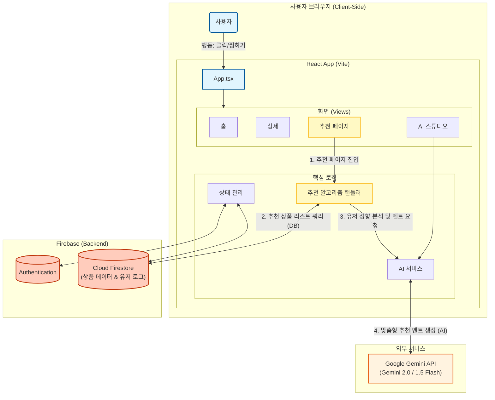

# 시스템 구성도

```mermaid
graph TD
    %% 스타일 정의
    classDef client fill:#e1f5fe,stroke:#01579b,stroke-width:2px;
    classDef server fill:#fff3e0,stroke:#e65100,stroke-width:2px;
    classDef firebase fill:#ffccbc,stroke:#bf360c,stroke-width:2px;
    classDef ai fill:#fff9c4,stroke:#fbc02d,stroke-width:2px;

    %% Client 영역
    subgraph Client ["사용자 브라우저 (Client-Side)"]
        direction TB
        User(사용자):::client
        
        subgraph Frontend ["React App (Vite)"]
            App["App.tsx"]:::client
            
            subgraph Views ["화면 (Views)"]
                Home[홈]
                Detail[상세]
                RecView[추천 페이지]:::ai
                AiStudio[AI 스튜디오]
            end
            
            subgraph Logic ["핵심 로직"]
                State[상태 관리]
                RecSystem[추천 알고리즘 핸들러]:::ai
                GeminiService[AI 서비스]
            end
        end
    end

    %% Firebase 영역
    subgraph Firebase ["Firebase (Backend)"]
        FB_Auth[("Authentication")]:::firebase
        FB_DB[("Cloud Firestore<br/>(상품 데이터 & 유저 로그)")]:::firebase
    end

    %% External 영역
    subgraph External ["외부 서비스"]
        GoogleAI["Google Gemini API<br/>(Gemini 2.0 / 1.5 Flash)"]:::server
    end

    %% 연결 관계
    User -->|"행동: 클릭/찜하기"| App
    App --> Views
    
    %% 추천 로직 흐름 (수정된 부분)
    RecView -->|"1. 추천 페이지 진입"| RecSystem
    
    %% 1. DB에서 상품 가져오기
    RecSystem <-->|"2. 추천 상품 리스트 쿼리 (DB)"| FB_DB
    
    %% 2. AI에게 멘트 요청하기
    RecSystem -->|"3. 유저 성향 분석 및 멘트 요청"| GeminiService
    GeminiService <-->|"4. 맞춤형 추천 멘트 생성 (AI)"| GoogleAI
    
    %% 기타 연결
    State <--> FB_Auth
    State <--> FB_DB
    AiStudio --> GeminiService
```
