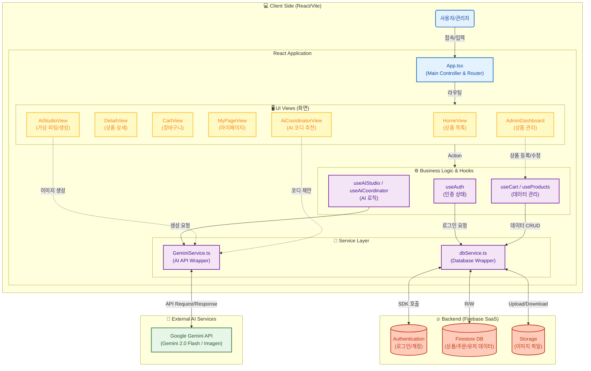

# AI Shopping App (StyleHub)

AI 기반 쇼핑몰 애플리케이션입니다. Google Gemini API를 활용한 AI 이미지 생성 기능과 Firebase를 통한 실시간 데이터 동기화를 제공합니다.

## 주요 기능

### 쇼핑 기능
- **상품 조회**: 카테고리별 상품 탐색 및 검색
- **상품 상세**: 상품 상세 정보 및 리뷰 확인
- **장바구니**: 상품 추가/삭제 및 수량 관리
- **위시리스트**: 관심 상품 저장 및 관리
- **최근 본 상품**: 최근 조회한 상품 기록

### AI 기능
- **AI 스튜디오**: 텍스트 프롬프트로 이미지 생성 (Gemini Imagen 3)
- **AI 코디네이터**: AI 기반 패션 코디 추천
- **내 사진 활용**: 업로드한 사진을 기반으로 한 이미지 생성

### 사용자 관리
- **회원가입/로그인**: Firebase Authentication
- **아이디/비밀번호 찾기**
- **마이페이지**: 사용자 정보 관리
- **관리자 대시보드**: 상품 관리 및 통계

## 🛠 기술 스택

### Frontend
- **React 19** - UI 라이브러리
- **TypeScript** - 타입 안정성
- **Vite** - 빌드 도구
- **Tailwind CSS** - 스타일링

### Backend & Services
- **Firebase**
  - Authentication (인증)
  - Cloud Firestore (데이터베이스)
  - Storage (파일 저장소)
- **Google Gemini API**
  - Gemini 2.0 Flash (텍스트 처리)
  - Imagen 3 (이미지 생성)

## 설치 및 실행

### 필수 요구사항
- Node.js 18 이상
- npm 또는 yarn

### 설치

```bash
# 저장소 클론
git clone https://github.com/wlghksw/AI-ShoppingAPP.git

# 프로젝트 디렉토리로 이동
cd AI-ShoppingAPP

# 의존성 설치
npm install
```

### 환경 변수 설정

프로젝트 루트에 `.env` 파일을 생성하고 다음 변수들을 설정하세요:

```env
# Firebase 설정
VITE_FIREBASE_API_KEY=your_firebase_api_key
VITE_FIREBASE_AUTH_DOMAIN=your_firebase_auth_domain
VITE_FIREBASE_PROJECT_ID=your_firebase_project_id
VITE_FIREBASE_STORAGE_BUCKET=your_firebase_storage_bucket
VITE_FIREBASE_MESSAGING_SENDER_ID=your_firebase_messaging_sender_id
VITE_FIREBASE_APP_ID=your_firebase_app_id

# Google Gemini API 키
VITE_GEMINI_API_KEY=your_gemini_api_key
```

> **참고**: 현재 코드에는 기본 설정값이 포함되어 있지만, 프로덕션 환경에서는 반드시 환경 변수를 사용하세요.

### 실행

```bash
# 개발 서버 실행
npm run dev

# 빌드
npm run build

# 빌드 미리보기
npm run preview
```

개발 서버가 실행되면 브라우저에서 `http://localhost:5173` (또는 표시된 포트)로 접속하세요.

# 시스템 구성도




## 프로젝트 구조

```
AI-ShoppingAPP/
├── components/          # 재사용 가능한 컴포넌트
│   ├── AdminDashboard.tsx
│   ├── AdminLogin.tsx
│   ├── GlobalHeader.tsx
│   ├── Login.tsx
│   ├── Navbar.tsx
│   ├── ProductCard.tsx
│   └── ...
├── hooks/              # Custom Hooks
│   ├── useAuth.ts
│   ├── useCart.ts
│   ├── useProducts.ts
│   ├── useWishlist.ts
│   └── ...
├── services/           # 서비스 레이어
│   ├── firebaseConfig.ts
│   ├── dbService.ts
│   ├── geminiService.ts
│   └── useAiCoordinator.ts
├── views/              # 페이지 컴포넌트
│   ├── HomeView.tsx
│   ├── DetailView.tsx
│   ├── CartView.tsx
│   ├── AiStudioView.tsx
│   └── ...
├── App.tsx             # 메인 앱 컴포넌트
├── types.ts            # TypeScript 타입 정의
├── constants.ts        # 상수 정의
└── package.json        # 프로젝트 설정
```

## 주요 기능 설명

### AI 스튜디오
텍스트 프롬프트를 입력하면 Google Gemini의 Imagen 3를 사용하여 고품질 이미지를 생성합니다. 생성된 이미지를 상품으로 등록하거나 장바구니에 추가할 수 있습니다.

### AI 코디네이터
사용자의 선호도와 스타일을 분석하여 AI가 패션 코디를 추천합니다.

### 실시간 데이터 동기화
Firebase Firestore를 사용하여 상품 정보, 장바구니, 위시리스트 등이 실시간으로 동기화됩니다.

## 관리자 기능

관리자 계정으로 로그인하면 다음 기능을 사용할 수 있습니다:
- 상품 추가/수정/삭제
- 전체 상품 관리
- 통계 및 분석

